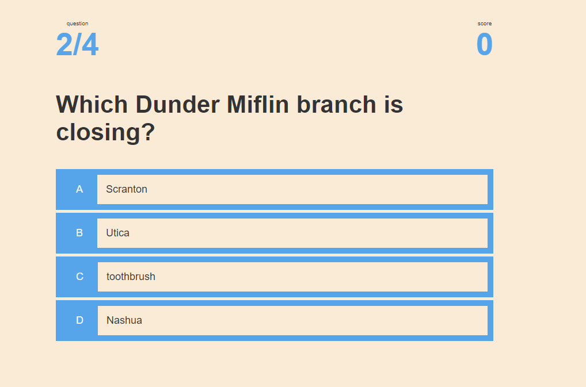

### License: , (https://opensource.org/licenses/MIT)

# Title: Code Quiz

## link to deployed app
Your site is live at https://banjosquash.github.io/code-quiz/

## Screenshot

## Description:
This is a 4 question quiz app, that has a 30 sec timer, if you miss a question 10sec is deducted as a penalty.
## Table of Contents:
* [title](#title)
* [Description](#description)
* [Table of Contents](#table-of-contents)
* [Installation](#installation)
* [Usage](#usage)
* [License](#license)
* [Contributing](#contributing)
* [Testing](#testing)
* [Questions](#questions)
      
## Installation: simply follow the link to try it out!

## Usage: 
see installation^
## Licensing: This application is covered under MIT License.

## Contributing: 
feel free to contribute!
## Testing Instructions: 
testing done in editor
## Questions: 
ask away!
Contact Me:

Github: https://github.com/banjosquash

Email: braymcmahan@yahoo.com
